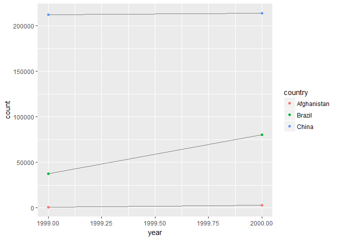
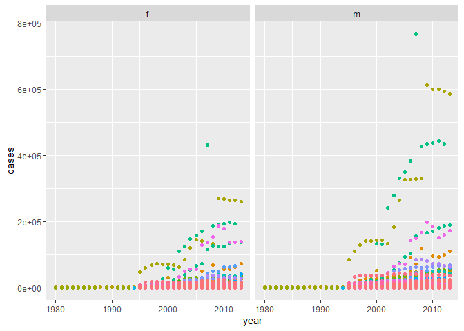
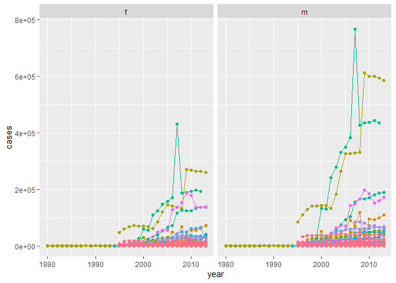
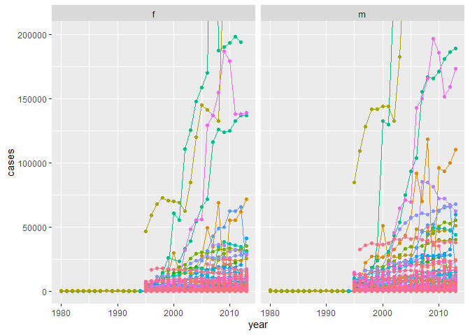

```r
library(tidyverse)
```

Joins tutorial (http://malooflab.phytonetworks.org/apps/joins-tutorial/)

## 12.2 Tidy data


```r
table1
```

```
## # A tibble: 6 x 4
##   country      year  cases population
##   <chr>       <int>  <int>      <int>
## 1 Afghanistan  1999    745   19987071
## 2 Afghanistan  2000   2666   20595360
## 3 Brazil       1999  37737  172006362
## 4 Brazil       2000  80488  174504898
## 5 China        1999 212258 1272915272
## 6 China        2000 213766 1280428583
```

```r
table2
```

```
## # A tibble: 12 x 4
##    country      year type            count
##    <chr>       <int> <chr>           <int>
##  1 Afghanistan  1999 cases             745
##  2 Afghanistan  1999 population   19987071
##  3 Afghanistan  2000 cases            2666
##  4 Afghanistan  2000 population   20595360
##  5 Brazil       1999 cases           37737
##  6 Brazil       1999 population  172006362
##  7 Brazil       2000 cases           80488
##  8 Brazil       2000 population  174504898
##  9 China        1999 cases          212258
## 10 China        1999 population 1272915272
## 11 China        2000 cases          213766
## 12 China        2000 population 1280428583
```

```r
table3
```

```
## # A tibble: 6 x 3
##   country      year rate             
## * <chr>       <int> <chr>            
## 1 Afghanistan  1999 745/19987071     
## 2 Afghanistan  2000 2666/20595360    
## 3 Brazil       1999 37737/172006362  
## 4 Brazil       2000 80488/174504898  
## 5 China        1999 212258/1272915272
## 6 China        2000 213766/1280428583
```

```r
table4a
```

```
## # A tibble: 3 x 3
##   country     `1999` `2000`
## * <chr>        <int>  <int>
## 1 Afghanistan    745   2666
## 2 Brazil       37737  80488
## 3 China       212258 213766
```

```r
table4b
```

```
## # A tibble: 3 x 3
##   country         `1999`     `2000`
## * <chr>            <int>      <int>
## 1 Afghanistan   19987071   20595360
## 2 Brazil       172006362  174504898
## 3 China       1272915272 1280428583
```

The sample tibbles are included in the `tidyverse`, but this is one way to create those manually in R.
```
table1 <- tibble(
  country = rep(c("Afghanistan", "Brazil", "China"), each = 2),
  year = rep(c(1999, 2000), times = 3),
  cases = c(745, 2666, 37737, 80488, 212258, 213766),
  population = c(19987071, 20595360, 172006362, 174504898, 1272915272, 1280428583)
)

table2 <- tibble(
  country = rep(c("Afghanistan", "Brazil", "China"), each = 4),
  year = rep(c(1999, 2000), each = 2, times = 3),
  type = rep(c("cases", "population"), times = 6),
  count = c(745, 19987071, 2666, 20595360, 37737, 172006362, 80488, 174504898, 212258, 1272915272, 213766, 1280428583)
)

table3 <- tibble(
  country = rep(c("Afghanistan", "Brazil", "China"), each = 2),
  year = rep(c(1999, 2000), times = 3),
  rate = c("745/19987071", "2666/20595360", "37737/172006362", "80488/174504898", "212258/1272915272", "213766/1280428583")
)

table4a <- tibble(
  country = c("Afghanistan", "Brazil", "China"),
  `1999` = c(745, 37737, 212258),
  `2000` = c(2666, 80488, 213766)
)

table4b <- tibble(
  country = c("Afghanistan", "Brazil", "China"),
  `1999` = c(19987071, 172006362, 1272915272),
  `2000` = c(20595360, 174504898, 1280428583)
)
```

### 12.2.1 

**1. Using prose, describe how the variables and observations are organised in each of the sample tables.**  
*only need to think about this question*  
`table1`: tidy  
`table2`: one observation per row, but more than one variable per column  
`table3`: more than one value per cell  
`table4a` and `table4b`: more than one observation per row  

**2. Compute the `rate` for `table2`, and `table4a` + `table4b`. You will need to perform four operations:**

  1. Extract the number of TB cases per country per year.
  2. Extract the matching population per country per year.
  3. Divide cases by population, and multiply by 10000.
  4. Store back in the appropriate place.
  
  **Which representation is easiest to work with? Which is hardest? Why?**
  

```r
# rate for table2

# extract cases per country per year
(cases <- table2 %>% filter(type == "cases"))
```

```
## # A tibble: 6 x 4
##   country      year type   count
##   <chr>       <int> <chr>  <int>
## 1 Afghanistan  1999 cases    745
## 2 Afghanistan  2000 cases   2666
## 3 Brazil       1999 cases  37737
## 4 Brazil       2000 cases  80488
## 5 China        1999 cases 212258
## 6 China        2000 cases 213766
```

```r
# extract population per country per year
(population <- table2 %>% filter(type == "population"))
```

```
## # A tibble: 6 x 4
##   country      year type            count
##   <chr>       <int> <chr>           <int>
## 1 Afghanistan  1999 population   19987071
## 2 Afghanistan  2000 population   20595360
## 3 Brazil       1999 population  172006362
## 4 Brazil       2000 population  174504898
## 5 China        1999 population 1272915272
## 6 China        2000 population 1280428583
```

```r
# divide cases by population and multiply by 10000
(rate <- tibble(
  country = rep(c("Afghanistan", "Brazil", "China"), each = 2),
  year = rep(c(1999, 2000), times = 3),
  type = "rate", 
  count = cases$count / population$count * 10000
))
```

```
## # A tibble: 6 x 4
##   country      year type  count
##   <chr>       <dbl> <chr> <dbl>
## 1 Afghanistan  1999 rate  0.373
## 2 Afghanistan  2000 rate  1.29 
## 3 Brazil       1999 rate  2.19 
## 4 Brazil       2000 rate  4.61 
## 5 China        1999 rate  1.67 
## 6 China        2000 rate  1.67
```

```r
# store back in table2
table2_rate <- rbind(table2, rate) %>% 
  arrange(country, year, type)
table2_rate
```

```
## # A tibble: 18 x 4
##    country      year type         count
##    <chr>       <dbl> <chr>        <dbl>
##  1 Afghanistan  1999 cases      7.45e+2
##  2 Afghanistan  1999 population 2.00e+7
##  3 Afghanistan  1999 rate       3.73e-1
##  4 Afghanistan  2000 cases      2.67e+3
##  5 Afghanistan  2000 population 2.06e+7
##  6 Afghanistan  2000 rate       1.29e+0
##  7 Brazil       1999 cases      3.77e+4
##  8 Brazil       1999 population 1.72e+8
##  9 Brazil       1999 rate       2.19e+0
## 10 Brazil       2000 cases      8.05e+4
## 11 Brazil       2000 population 1.75e+8
## 12 Brazil       2000 rate       4.61e+0
## 13 China        1999 cases      2.12e+5
## 14 China        1999 population 1.27e+9
## 15 China        1999 rate       1.67e+0
## 16 China        2000 cases      2.14e+5
## 17 China        2000 population 1.28e+9
## 18 China        2000 rate       1.67e+0
```


```r
# rate for table4a + table4b

# extract cases per country per year
## this is what table4a is
# extract population per country per year
## this is what table4b is

# divide cases by population and multiply by 10000
(rate <- tibble(
  country = rep(c("Afghanistan", "Brazil", "China"), each = 2),
  year = rep(c(1999, 2000), times = 3),
  type = "rate", 
  count = cases$count / population$count * 10000
))
```

```
## # A tibble: 6 x 4
##   country      year type  count
##   <chr>       <dbl> <chr> <dbl>
## 1 Afghanistan  1999 rate  0.373
## 2 Afghanistan  2000 rate  1.29 
## 3 Brazil       1999 rate  2.19 
## 4 Brazil       2000 rate  4.61 
## 5 China        1999 rate  1.67 
## 6 China        2000 rate  1.67
```

```r
# store back in appropriate place
## each variable is stored in its own tibble, so this fits the current format
```

I suppose the `table4` representation is easier to work with, while the `table2` representation is harder to work with. This is because `table4` already had the variables split up, so I didn't have to separate out cases and population like I had to do with `table2`. However, `table1` would have certainly been the easiest.

**3. Recreate the plot showing change in cases over time using table2 instead of table1. What do you need to do first?**


```r
table2 %>% filter(type == "cases") %>% 
  ggplot(aes(year, count)) + 
  geom_line(aes(group = country), color = "grey50") + 
  geom_point(aes(color = country))
```

<!-- -->

When using `table2`, you first need to filter the data to only include `cases` and not `population`. 

## 12.3 Spreading and gathering

### 12.3.3  

**1. Why are `gather()` and `spread()` not perfectly symmetrical? Carefully consider the following example:**  

```r
stocks <- tibble(
  year   = c(2015, 2015, 2016, 2016),
  half  = c(   1,    2,     1,    2),
  return = c(1.88, 0.59, 0.92, 0.17)
)
stocks %>% 
  spread(year, return) %>%
  gather("year", "return", `2015`:`2016`)
```

```
## # A tibble: 4 x 3
##    half year  return
##   <dbl> <chr>  <dbl>
## 1     1 2015    1.88
## 2     2 2015    0.59
## 3     1 2016    0.92
## 4     2 2016    0.17
```

*(Hint: look at the variable types and think about column names.)*

**Both `spread()` and `gather()` have a convert argument. What does it do?**

When `stocks` is `spread()` and the years become column names, information about `year` variable type is lost. As a result, `year` is a character vector after `spread()` and `gather()`. 

`convert` appears to re-assign variable types according to R's best guess based on the values. This seems to produce more consistent variable types before and after `spread()` or `gather()`. 

**2. Why does this code fail?**

```{}
table4a %>% 
  gather(1999, 2000, key = "year", value = "cases")
#> Error in inds_combine(.vars, ind_list): Position must be between 0 and n
```

Since this is missing the backticks around each year, R is looking for column position 1999 and 2000. However, it can't find these positions because the dataset is not that large. 

**3. Why does spreading this tibble fail? How could you add a new column to fix the problem?**

```{}
people <- tribble(
  ~name,             ~key,    ~value,
  #-----------------|--------|------
  "Phillip Woods",   "age",       45,
  "Phillip Woods",   "height",   186,
  "Phillip Woods",   "age",       50,
  "Jessica Cordero", "age",       37,
  "Jessica Cordero", "height",   156
)
```

Spreading this tibble fails because not all of the name by key combinations are unique. When R tries to spread, it finds two rows for "Phillip Woods" and "age". A new column could be added with an assigned individual number or some other unique identification per person. This would distinguish between the two entries for "Phillip Woods". 

**4. Tidy the simple tibble below. Do you need to spread or gather it? What are the variables?**


```r
preg <- tribble(
  ~pregnant, ~male, ~female,
  "yes",     NA,    10,
  "no",      20,    12
)
```

This tibble needs to be gathered in order to be tidy.  
The variables are:
  * `pregnant`: "yes" or "no"
  * `sex`: "male" or "female"
  * `count`: number of pregnant people per sex


```r
preg %>% gather("male", "female", key = sex, value = count)
```

```
## # A tibble: 4 x 3
##   pregnant sex    count
##   <chr>    <chr>  <dbl>
## 1 yes      male      NA
## 2 no       male      20
## 3 yes      female    10
## 4 no       female    12
```

## 12.4 Separating and uniting

### 12.4.3

**1. What do the extra and fill arguments do in separate()? Experiment with the various options for the following two toy datasets.**  

The `extra` argument determines what happens when there are more separations that need to happen than the number specified in the `sep` vector. By default, R will drop the extra values and give you a warning. However, you can tell R to either `drop` extra values without a warning or `merge` extra values together while keeping them in the final dataset. 


```r
# default, drop with warning
tibble(x = c("a,b,c", "d,e,f,g", "h,i,j")) %>% 
  separate(x, c("one", "two", "three"), extra = "merge")
```

```
## # A tibble: 3 x 3
##   one   two   three
##   <chr> <chr> <chr>
## 1 a     b     c    
## 2 d     e     f,g  
## 3 h     i     j
```

```r
# merge
tibble(x = c("a,b,c", "d,e,f,g", "h,i,j")) %>% 
  separate(x, c("one", "two", "three"), extra = "merge")
```

```
## # A tibble: 3 x 3
##   one   two   three
##   <chr> <chr> <chr>
## 1 a     b     c    
## 2 d     e     f,g  
## 3 h     i     j
```

The `fill` argument conversely determines what happens when the `sep` vector is longer than the number of separations that need to happen. Similar to `extra`, the default option is to fill from the right and give you a warning. However, you can tell R to omit the warning and either fill values from the `right` or `left`. 


```r
# default, fill from right with warning
tibble(x = c("a,b,c", "d,e", "f,g,i")) %>% 
  separate(x, c("one", "two", "three"))
```

```
## Warning: Expected 3 pieces. Missing pieces filled with `NA` in 1 rows [2].
```

```
## # A tibble: 3 x 3
##   one   two   three
##   <chr> <chr> <chr>
## 1 a     b     c    
## 2 d     e     <NA> 
## 3 f     g     i
```

```r
# fill from left
tibble(x = c("a,b,c", "d,e", "f,g,i")) %>% 
  separate(x, c("one", "two", "three"), fill = "left")
```

```
## # A tibble: 3 x 3
##   one   two   three
##   <chr> <chr> <chr>
## 1 a     b     c    
## 2 <NA>  d     e    
## 3 f     g     i
```

**2. Both `unite()` and `separate()` have a `remove` argument. What does it do? Why would you set it to `FALSE`?**  

By default, `unite()` and `separate()` don't include the initial converted column(s) in the output, which is the same as `remove = TRUE`. So generally, `remove` determines if the input column(s) are retained in the output or not. If you would like to keep the input column in the output, then you would set `remove = FALSE`. 


```r
tibble(x = c("a,b,c", "d,e,f", "g,h,i")) %>% 
  separate(x, c("one", "two", "three"))
```

```
## # A tibble: 3 x 3
##   one   two   three
##   <chr> <chr> <chr>
## 1 a     b     c    
## 2 d     e     f    
## 3 g     h     i
```

```r
tibble(x = c("a,b,c", "d,e,f", "g,h,i")) %>% 
  separate(x, c("one", "two", "three"), remove = FALSE)
```

```
## # A tibble: 3 x 4
##   x     one   two   three
##   <chr> <chr> <chr> <chr>
## 1 a,b,c a     b     c    
## 2 d,e,f d     e     f    
## 3 g,h,i g     h     i
```

Personally, I've done this before when I wanted to have a column containing two variables to `color` by, but then I wanted to `facet` by only one of those variables. For instance separate "light_treatment" by `color` and facet by "light". 

**3. Compare and contrast `separate()` and `extract()`. Why are there three variations of separation (by position, by separator, and with groups), but only one unite?**   

Both `separate()` and `extract()` can split one column into multiple output columns. However, `separate()` can only split by position or a separator while `extract()` can use regular expressions to determine groups and split by those groups. 

There are three variations of separation because there are a lot of possibilies for how you would want to split one column, but there is only one unite because there is really only one output method for joining columns together.

## 12.6 Case Study

### 12.6.1 


```r
# recreate tidy data
who1 <- who %>%
  gather(key, value, new_sp_m014:newrel_f65, na.rm = TRUE) %>% 
  mutate(key = stringr::str_replace(key, "newrel", "new_rel")) %>%
  separate(key, c("new", "var", "sexage")) %>% 
  select(-new) %>% 
  separate(sexage, c("sex", "age"), sep = 1)
```

**3. I claimed that iso2 and iso3 were redundant with country. Confirm this claim.**


```r
head(who1)
```

```
## # A tibble: 6 x 8
##   country     iso2  iso3   year var   sex   age   value
##   <chr>       <chr> <chr> <int> <chr> <chr> <chr> <int>
## 1 Afghanistan AF    AFG    1997 sp    m     014       0
## 2 Afghanistan AF    AFG    1998 sp    m     014      30
## 3 Afghanistan AF    AFG    1999 sp    m     014       8
## 4 Afghanistan AF    AFG    2000 sp    m     014      52
## 5 Afghanistan AF    AFG    2001 sp    m     014     129
## 6 Afghanistan AF    AFG    2002 sp    m     014      90
```

```r
# pull out unique rows and count by country
who1[ , 1:3] %>%
  unique() %>%
  count(country) %>% 
  filter(n > 1)
```

```
## # A tibble: 0 x 2
## # ... with 2 variables: country <chr>, n <int>
```

Each country only has one row in this unique dataset, which means that every country has the same iso2 and iso3 entries. This makes sense because the data documentation specifies that iso2 contains two letter ISO country codes and iso3 containes three letter ISO country codes, so they should be redundant. 

**4. For each country, year, and sex compute the total number of cases of TB. Make an informative visualisation of the data.**


```r
# remove iso2 and iso3 columns
who2 <- who1 %>% 
  select(-iso2, -iso3)

# convert into factors
who2$country <- as.factor(who2$country)
who2$sex <- as.factor(who2$sex)
  
# compute total cases of TB for each country, year, and sex
who3 <- who2 %>% 
  group_by(country, year, sex) %>% 
  summarize(cases = sum(value))
head(who3)
```

```
## # A tibble: 6 x 4
## # Groups:   country, year [3]
##   country      year sex   cases
##   <fct>       <int> <fct> <int>
## 1 Afghanistan  1997 f       102
## 2 Afghanistan  1997 m        26
## 3 Afghanistan  1998 f      1207
## 4 Afghanistan  1998 m       571
## 5 Afghanistan  1999 f       517
## 6 Afghanistan  1999 m       228
```

```r
# visualize 
who3 %>% 
  ggplot(aes(x = year, y = cases, color = country)) + 
  facet_wrap(~ sex) + 
  theme(legend.position = "none") + 
  geom_point() 
```

<!-- -->

```r
who3 %>% 
  ggplot(aes(year, cases, color = country)) + 
  facet_wrap(~ sex) + 
  theme(legend.position = "none") + 
  geom_line() + 
  geom_point()
```

<!-- -->

```r
# try zooming in
who3 %>% 
  ggplot(aes(year, cases, color = country)) + 
  facet_wrap(~ sex) + 
  theme(legend.position = "none") + 
  geom_line() + 
  geom_point() + 
  coord_cartesian(ylim = c(0, 2e5))
```

<!-- -->

