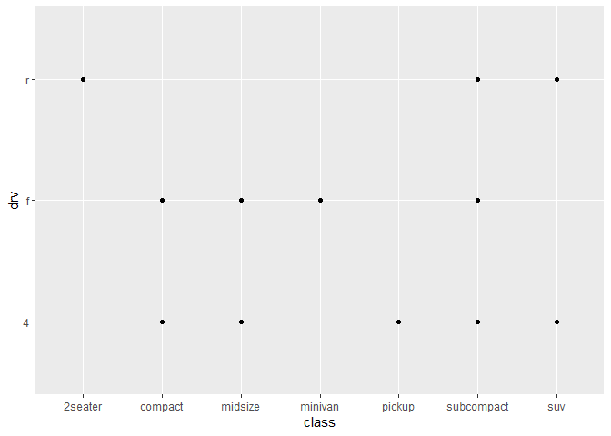
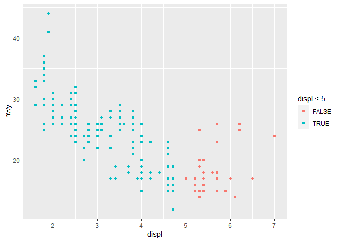
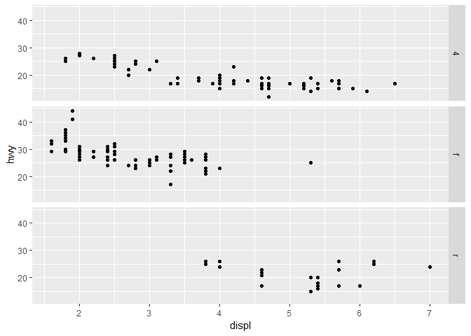
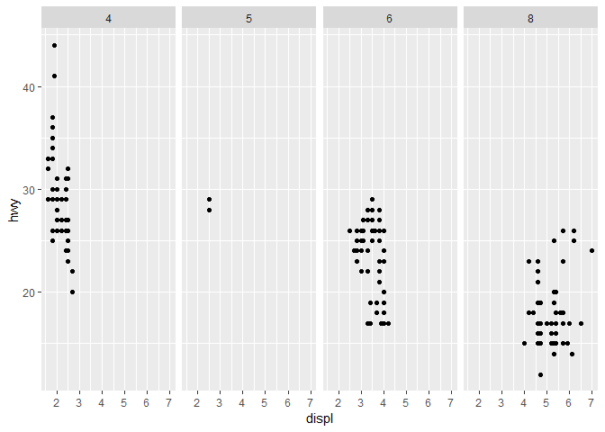
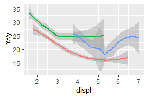
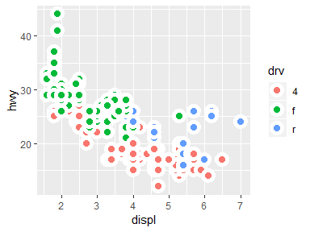

```
## -- Attaching packages ------------------------------- tidyverse 1.2.1 --
```

```
## v ggplot2 3.1.1       v purrr   0.3.2  
## v tibble  2.1.1       v dplyr   0.8.0.1
## v tidyr   0.8.3       v stringr 1.4.0  
## v readr   1.3.1       v forcats 0.4.0
```

```
## -- Conflicts ---------------------------------- tidyverse_conflicts() --
## x dplyr::filter() masks stats::filter()
## x dplyr::lag()    masks stats::lag()
```

## 3.2 First Steps

### 3.2.4 

**1. Run `ggplot(data = mpg)`. What do you see?**

```r
ggplot(data = mpg)
```

<!-- -->

This is an empty graph because there is no layer that specifies plot type.

**2. How many rows are in `mpg`? How many columns?** 

```r
nrow(mpg)
```

```
## [1] 234
```

```r
ncol(mpg)
```

```
## [1] 11
```
234 rows in `mpg` and 11 columns in `mpg`. 

**3. What does the `drv` variable describe? Read the helper for `?mpg` to find out.**  
`drv` describes the drive type of the car (i.e. front-wheel drive, rear-wheel drive, or four-wheel drive). 

**4. Make a scatterplot of `hwy` vs `cyl`.**   

```r
ggplot(mpg) + 
  geom_point(aes(hwy, cyl))
```

<!-- -->

**5. What happens if you make a scatterplot of `class` vs `drv`? Why is the plot not useful?**  

```r
ggplot(mpg) + 
  geom_point(aes(class, drv))
```

<!-- -->

The points are just stacked on top of each other because both of these are discrete variables. Not useful because you can't see how many points are at each intersection.

## 3.3 Aesthetic Mappings

### 3.3.1 

**1. What's gone wrong with this code? Why are the points not blue?**

```r
ggplot(mpg) + 
  geom_point(aes(displ, hwy, color = "blue"))
```

<!-- -->

Since `aes` specifies variables, R has created a new variable called "colour" and specified its value as "blue". To fix this, remove `color` from the `aes` mapping.

```r
ggplot(mpg) + 
  geom_point(aes(displ, hwy), color = "blue")
```

<!-- -->

**2. Which variables in `mpg` are categorical? Which variables are continuous? (Hint: type `?mpg` to read the documentation for the dataset). How can you see this information when you run `mpg`?**  
`manufacturer`, `model`, `year`, `cyl`, `trans`, `drv`, `fl`, and `class` are categorical variables. `displ`, `cty`, and `hwy` are continuous variables. 

```r
str(mpg)
```

```
## Classes 'tbl_df', 'tbl' and 'data.frame':	234 obs. of  11 variables:
##  $ manufacturer: chr  "audi" "audi" "audi" "audi" ...
##  $ model       : chr  "a4" "a4" "a4" "a4" ...
##  $ displ       : num  1.8 1.8 2 2 2.8 2.8 3.1 1.8 1.8 2 ...
##  $ year        : int  1999 1999 2008 2008 1999 1999 2008 1999 1999 2008 ...
##  $ cyl         : int  4 4 4 4 6 6 6 4 4 4 ...
##  $ trans       : chr  "auto(l5)" "manual(m5)" "manual(m6)" "auto(av)" ...
##  $ drv         : chr  "f" "f" "f" "f" ...
##  $ cty         : int  18 21 20 21 16 18 18 18 16 20 ...
##  $ hwy         : int  29 29 31 30 26 26 27 26 25 28 ...
##  $ fl          : chr  "p" "p" "p" "p" ...
##  $ class       : chr  "compact" "compact" "compact" "compact" ...
```

**3. Map a continuous variable to `color`, `size`, and `shape`. How do these aesthetics behave differently for categorical vs. continuous variables?**   

```r
ggplot(mpg) + 
  geom_point(aes(displ, hwy, color = hwy, size = cty))
```

<!-- -->

Color and size both create scales of differences and then plot based on that scale. Shape however can't be mapped to a continuous variable.

**4. What happens if you map the same variable to multiple aesthetics?**  
Mapping the same variable to multiple aesthetics simply applies both aesthetics to that variable.

```r
ggplot(mpg) + 
  geom_point(aes(displ, hwy, color = cty, size = cty))
```

<!-- -->

**5. What does the `stroke` aesthetic do? What shapes does it work with? (Hint: use `?geom_point`)**  
`stroke` modifies the width of shape borders. Therefore, it only works with shapes that have borders (0-14 and 21-24). 

```r
ggplot(mpg) + 
  geom_point(aes(displ, hwy), shape = 24, color = "red", fill = "black", stroke = 1)
```

<!-- -->

```r
ggplot(mpg) + 
  geom_point(aes(displ, hwy), shape = 24, color = "red", fill = "black", stroke = 3)
```

<!-- -->

**6. What happens if you map an aesthetic to something other than a variable name, like `aes(colour = displ < 5)`? Note, you’ll also need to specify x and y.**    

```r
ggplot(mpg) + 
  geom_point(aes(displ, hwy, color = displ < 5))
```

<!-- -->

If you map an aesthetic to a condition, then R will change the aesthetic based on whether or not the point satisfies the condition. Here, cars with engine displacement less than 5 are shown in blue and cars with engine displacement greater than 5 are shown in red.

## 3.5 Facets

### 3.5.1 

**1. What happens if you facet on a continuous variable?**  

```r
ggplot(mpg) + 
  geom_point(aes(displ, hwy)) + 
  facet_wrap(~ cty)
```

<!-- -->

R will simply make a facet for each value of the continuous variable.

**2. What do the empty cells in plot with `facet_grid(drv ~ cyl)` mean? How do they relate to this plot?** 

```r
ggplot(mpg) + 
  geom_point(aes(drv, cyl))
```

<!-- -->

```r
ggplot(mpg) + 
  geom_point(aes(displ, hwy)) + 
  facet_grid(drv ~ cyl)
```

<!-- -->

Empty cells in the facets mean that there is nothing that fits in that combination of variables. For example, you can see from both of the above plots that there are no cars with four-wheel drive that have 5 cylinders. 

**3. What plots does the following code make? What does `.` do?** 

```r
ggplot(mpg) + 
  geom_point(aes(displ, hwy)) + 
  facet_grid(drv ~ .) 
```

<!-- -->

```r
ggplot(mpg) + 
  geom_point(aes(displ, hwy)) + 
  facet_grid(. ~ cyl)
```

<!-- -->

The first plot has facets arranged in rows and the second plot has facets arranged in columns. The `.` fills in for one of the variables in `facet_grid` so that one variable can be faceted in a specific orientation.

**4. Take the first faceted plot in this section:**

```r
ggplot(mpg) + 
  geom_point(aes(displ, hwy)) + 
  facet_wrap(~ class, nrow = 2)
```

<!-- -->

**What are the advantages to using faceting instead of the colour aesthetic? What are the disadvantages? How might the balance change if you had a larger dataset?**   
Advantages: The data is separated so that trends for each value of the faceted variable can be analyzed individually. Also reduces overplotting. Disadvantages: Direct comparisons can't be made as easily between values of the faceted variable. With a larger dataset, faceting would be much more useful than color to prevent the graph from becoming too crowded. 

**5. Read `?facet_wrap`. What does `nrow` do? What does `ncol` do? What other options control the layout of the individual panels? Why doesn’t `facet_grid()` have `nrow` and `ncol` arguments?**  
`nrow` specifies the number of rows and `ncol` specifies the number of columns. `as.table` and `dir` also control panel layout. `facet_grid()` doesn't have `nrow` and `ncol` arguments because the two variables set how many rows and columns there are.

```r
ggplot(mpg) + 
  geom_point(aes(displ, hwy)) + 
  facet_wrap(~ cyl, dir = "v", as.table = FALSE)
```

<!-- -->

**6. When using `facet_grid()` you should usually put the variable with more unique levels in the columns. Why?**   


```r
ggplot(mpg) + 
  geom_point(aes(displ, hwy)) + 
  facet_grid(drv ~ class)
```

<!-- -->

```r
ggplot(mpg) + 
  geom_point(aes(displ, hwy)) + 
  facet_grid(class ~ drv)
```

<!-- -->

R seems to have a standard plot size that is wider than it is tall, so there is better visibility when more unique levels are in the columns instead of rows. 

## 3.6 Geometric Objects

### 3.6.1

**1. What geom would you use to draw a line chart? A boxplot? A histogram? An area chart?**  
`geom_line()` = line chart  
`geom_boxplot()` = boxplot  
`geom_histogram()` = histogram  
`geom_area()` = area chart  

**2. Run this code in your head and predict what the output will look like. Then, run the code in R and check your predictions.**    
Prediction: Graph of engine displacement on x axis and highway miles per gallon on y axis with everything colored by the type of drive (so three colors total). Each car will be visualized as a point (colored by drive type) plus there will be three fitted trend lines (separated and colored by drive type) which don't include shading for standard error.

```r
ggplot(mpg, aes(displ, hwy, color = drv)) + 
  geom_point() + 
  geom_smooth(se = FALSE)
```

```
## `geom_smooth()` using method = 'loess' and formula 'y ~ x'
```

<!-- -->

**3. What does `show.legend = FALSE` do? What happens if you remove it? Why do you think I used it earlier in the chapter?**   
`show.legend = FALSE` removes the legend from the graph. When this is removed, the legend will be displayed with the graph. The legend was likely removed earlier in the chapter because including the legend changes the scale of the graph and makes it less comparable to other similar graphs.




**4. What does the `se` argument to `geom_smooth()` do?**  
`se` shades the standard error around the trend line for `geom_smooth()`. 

**5. Will these two graphs look different? Why/why not?** 

```r
ggplot(mpg, aes(displ, hwy)) + 
  geom_point() + 
  geom_smooth()

ggplot() + 
  geom_point(mpg, mapping = aes(displ, hwy)) + 
  geom_smooth(mpg, mapping = aes(displ, hwy))
```


These two graphs will look the same because they contain the same specifications. For the first graph the aesthetics are just specified once for the entire graph, while the second graph has the same aesthetics specified twice (once for each layer). 

**6. Recreate the R code necessary to generate the following graphs.** 


```r
# graph 1
ggplot(mpg, aes(displ, hwy)) + 
  geom_point() + 
  geom_smooth(se = FALSE)

# graph 2
ggplot(mpg, aes(displ, hwy)) + 
  geom_point() + 
  geom_smooth(aes(group = drv), se = FALSE)
```


```r
# graph 3
ggplot(mpg, aes(displ, hwy, color = drv)) + 
  geom_point() + 
  geom_smooth(se = FALSE)

# graph 4
ggplot(mpg, aes(displ, hwy)) + 
  geom_point(aes(color = drv)) + 
  geom_smooth(se = FALSE)
```


```r
# graph 5
ggplot(mpg, aes(displ, hwy)) + 
  geom_point(aes(color = drv)) + 
  geom_smooth(aes(linetype = drv), se = FALSE)

# graph 6
ggplot(mpg, aes(displ, hwy)) + 
  geom_point(color = "white", size = 4) + 
  geom_point(aes(color = drv))
```


**Experimenting with graph 6**   
Note the difference between these two graphs.

```r
# graph 6 as above
ggplot(mpg, aes(displ, hwy)) + 
  geom_point(color = "white", size = 6) + 
  geom_point(aes(color = drv), size = 3)

# similar, but changing shape
ggplot(mpg, aes(displ, hwy, fill = drv)) + 
  geom_point(shape = 21, color = "white", size = 3, stroke = 3)
```



